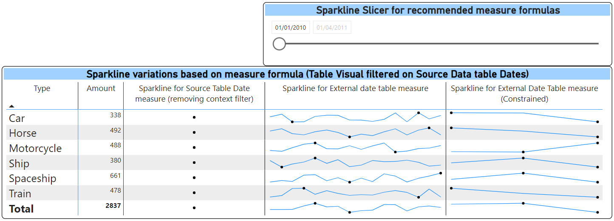

# PBI Sparklines Beyond Context Filters

> Tinkering with the new Power BI Sparklines (In Preview) to test techniques to have sparklines go beyond table context filters

---

### Table of Contents
- [Description](#description)
- [References](#references)
- [Installation](#installation)

---
## Description
The Power BI Engineering team released a preview of the much-awaited Table and Matrix visuals' Sparklines feature. Tinkering with it, i stumbled upon Ed Hansberry's blog post about how to override context filters for the X-axis field used in sparklines. This was super helpful and then I bumped into a special case where my matrix visual had a narrow filter applied (One Month) and I needed to get the sparklines to show different types of historical performance alongside (All history, Trailing three months...etc.). After a few initial failed attempts all complicating my Dax measure and even teh data model, I finally found a simple solution requiring a small additional table with no relationship needed in the data model. The table is basically a dimension table of the field used as X-axis for the sparkline which is then also used in the sparkline's underlying DAX measure. This allowed me to decouple the dependancy on any context filters with minimal cost to performance or model size. Hope you find it useful.
---
## References
- [Power BI Blog post announcing the preview of Sparklines](https://powerbi.microsoft.com/en-us/blog/power-bi-december-2021-feature-summary/)
- [Ed Hansberry's blog post](https://www.ehansalytics.com/blog/2021/12/8/working-with-sparklines-in-power-bi-all-about-the-filter-context)

---
## Installation
If you want to take this further, download files a local folder and change the source path for the Transactions.xlsx file in the Transactions query to point to your new location.
